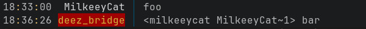
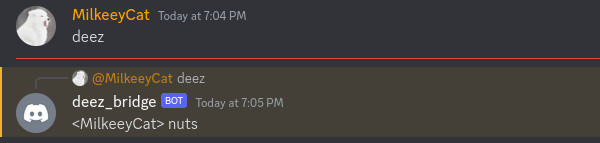
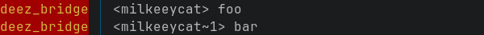

# DeezBridge

A toy project aimed to make a program which will copy messages from irc channel to discord and vice versa(and maybe with some cool features).
To run this thing you would need to set correct data in `.env` file first and then run command below to build the project

```bash
go build -o main cmd/main.go
```

## Feautres:

#### Replies
 <br/>
 <br/>

You can also reply from irc to a discord user's message, like so `!reply username~offset`, offset means user's nth last message.
If you want to reply to last message it's 1, pre last - 2, etc... When irc part of bridge wont be able to find a message others are replying to `offset` will be `-1`<br/>

 <br/>
 <br/>

#### Updated massages
They are simply resend but with ~n in it. If i sent in discord message "foo" and then updated to bar. It would look like this <br/>

 <br/>

#### Reactions
You can see when someone reacts to your and others messages. When someone will react to your message you will such a message <br/>
`who_react reacted with emoji_name to message_author~offset`

When someone will remove a reaction from a message it will look like <br/>
`who_removed_reaction removed reaction emoji_name from message_author~offset`

#### Deleting messages
You know how it happens, you are giga chad who doesn't use closed source pojects, only irc, only big dict energy.
But since we are all humans, we are prone to speak about worst takes ever. For example you were talking with your homies
about your favorite programming language and you say that dynamically typed languages are better then statically typed.
If I were you Id quickly hit `!del offset` where `offset` is number of your cringe take message from end.
So when they will call others to laugh at you(they think if you are irc user you cant delete messages) you will make them fools
